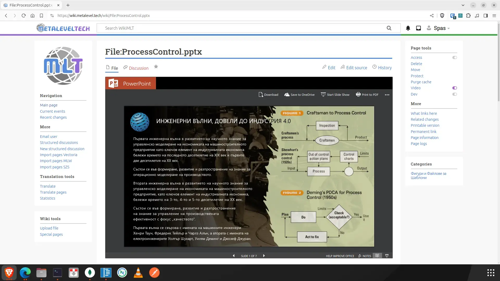
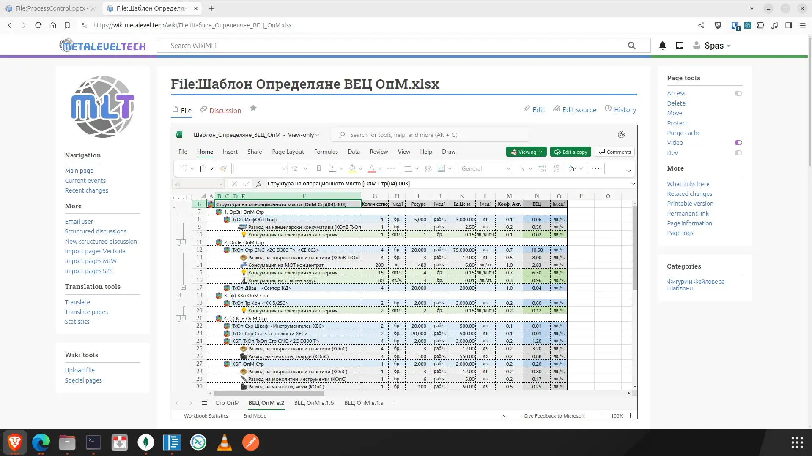

# MicroSoft Office 365 Files Handler

***[The extension is tested with MW 1.40](https://wiki.metalevel.tech/wiki/File:ProcessControl.pptx)***





MediaWiki media handler extension for Microsoft Office files, such as "xlsx", "docx", "pptx", "xlsm", "pptm", "docm", "ppsx" files by using:
* `https://view.officeapps.live.com/op/embed.aspx?src=...` or
*  `https://view.officeapps.live.com/op/view.aspx?src=...`

The extension will handle also "txt", "sh", "js", "css", "json" files, "html". All kind of these files will be embeded and displayed at their File:Pages via [JavaScript](modules/MSO365Handler.js). And the file's content will be [extracted](MSO365Handler.processor.sh) and pushed as content of a hidden `<div>` element on the File:Page so the search engine will index this content. For this purpose you ned to place the following code at the bottom of your [Template:Information](https://www.mediawiki.org/wiki/Template:Information):

```html
<div class="mso365-search-index">MSO365SearchIndex</div>
```
* The inner text will be displayed within the template page, but it will be hidden within File:Pages by additional [CSS](modules/MSO365Handler.css).

There is one additional [JavaScript](modules/MSO365HandlerMMV.js) that will redirect MultiMedia Viewer straight to the pages of the handled files. In addition you could create `File:Fileicon-docx.png`, `File:Fileicon-pptx.png`, `File:Fileicon-pptx.png`, etc. by uploading to your wiki the files from [`assets/file-type-icons/`](assets/file-type-icons) in order to trick MultiMedia Viewer to show them before the redirection.

In order to add icons for the mime-types theat are handled by the extension you could copy [`assets/file-type-icons/*.png`](assets/file-type-icons) to `$IP/resources/assets/file-type-icons/`. Or you could use the script [`link.sh`](assets/file-type-icons/link.sh) that will create symbolic links from `$IP/resources/assets/file-type-icons/` to these PNG files:

```bash
cd $IP/extensions/MSO365Handler/assets/file-type-icons
sudo -u ./link.sh
```

## Installation

Clone the extension:

```bash
cd $IP/extensions
sudo git clone https://github.com/metalevel-tech/mw-MSO365Handler.git MSO365Handler # HTTPS
sudo git clone git@github.com:metalevel-tech/mw-MSO365Handler.git MSO365Handler     # SSH
```

To install this extension, add the following to the end of the `LocalSettings.php` file:
```php
wfLoadExtension('MSO365Handler');
```

## Configuration

If the default configuration needs to be altered add these settings to the `LocalSettings.php` file below `wfLoadExtension('MSO365Handler')`:
```php
$wgMSO365Handler['height'] = '696px'; // CSS Width of the wrapper div
$wgMSO365Handler['width'] = '100%';   // CSS Height of the wrapper div
$wgMSO365Handler['style'] = 'border-radius: 0; border: 1px solid #323639; margin: 8px auto 18px;'; // CSS Style ...
$wgMSO365Handler['action'] = 'view'; // Actions: embed | view

$wgFileExtensions = array_merge($wgFileExtensions, [ 'pptx', 'docx', 'xlsx', 'txt', 'sh', 'json', 'etc.' ]);
```
* For the default values see [extension.json](extension.json).


## See also

* [Extension:MSO365Embed](https://github.com/metalevel-tech/mw-MSO365Embed)

## References


* https://www.mediawiki.org/wiki/Topic:Tbv4e1bjhv5hxkxt
* https://www.mediawiki.org/wiki/Manual:Image_administration#Image_thumbnailing 
* https://commons.wikimedia.org/wiki/Category:­Document_icons
* https://www.mediawiki.org/wiki/Manual:$wgFileExtensions
